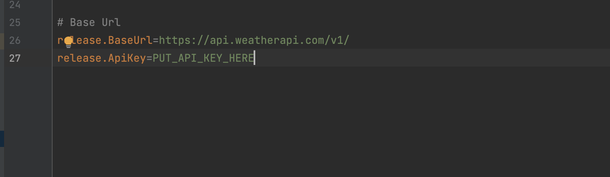
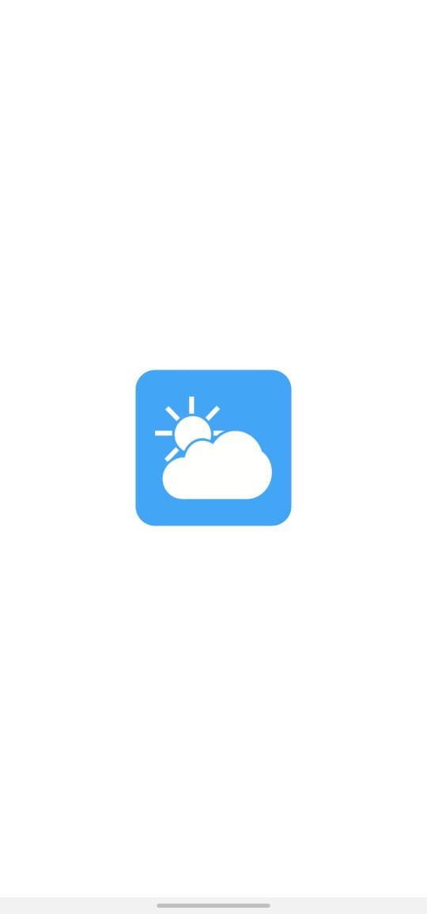
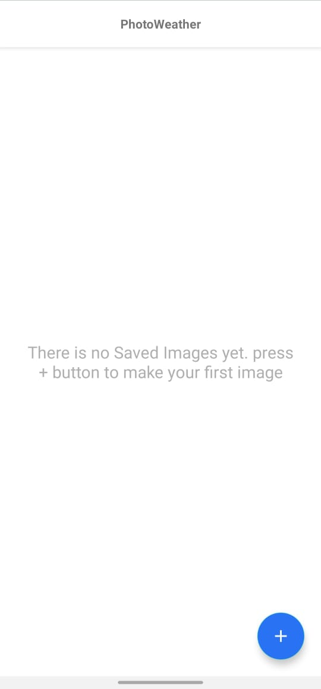
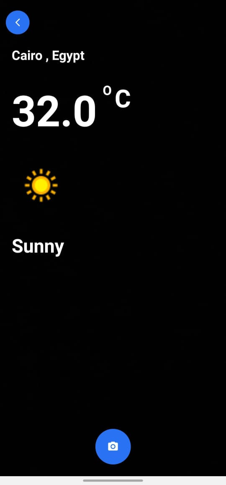
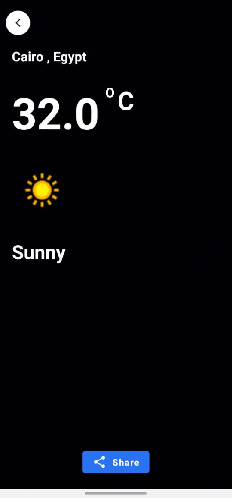

# PhotoWeather


simple app “Weather” application lets users take a photo,
add current weather information as a banner overlay on top of the photo,
and finally, share it on Facebook or Twitter .


# Installation

To install and run this project on your local machine, please follow the instructions below:


Clone the Repository

Clone this repository to your local machine using the following command:

```bash

git clone https://github.com/yaseerfarah/PhotoWeather.git

```

 # Import the Project in Android Studio
 
1- Open Android Studio.

2- Click on "Open an Existing Project" or select "File" > "Open" from the menu.

3- Navigate to the location where you cloned the repository and select the project's root directory.

4- Click "OK" to import the project.


 # Build and Run the Project
 
Once the project is open in Android Studio,

you need to sign up for an API key at:
https://www.weatherapi.com/, then replace the ‘PUT_API_KEY_HERE’ in gradle.properties  file below with the API key
assigned to your account.





* Then click build and wait for the Gradle sync to finish.
* Connect an Android device to your machine or set up an Android Virtual Device (AVD) using the Android Virtual Device (AVD) Manager.
* Click on the "Run" button in the toolbar or select "Run" > "Run app" from the menu.
* Choose the device you want to run the app on and click "OK".
* Android Studio will build the project, install the app on the selected device, and launch it.

 # Features

 Implemented by:
 * Kotlin
 * Clean Architecture
 * MVI Architecture Pattern
 * Hilt
 * Coroutine
 * ViewBinding
 * Retrofit
 * Room Database
 * Camerax Jetpack library
 * Navigation Componenet


 
 
 # Screens:
 
 * Splash Screen

  
  
   * Gallery Screen
  
  
  
   * Camera Weather Screen
  
  
  
  * Preview Screen
  
  
  
  
  
  
  
  
  
  
  
  
  
  
